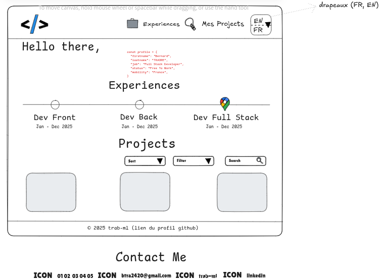

# Portfolio

```bash
npm run dev

# To access on mobile (if the computer and mobile are on the same network)
vite --host
```

## TODO

(18mns,)
- [x] Download projects images
- [x] Deal with i18n issues (miss of reactivity (even not translation) when changing language + externalize static data [projects + experience])
- [ ] Implement project filtering section
- [ ] Enhance the footer (add an anchor to the navlinks)
- [ ] Schematize the project big-picture
- [ ] Deploy the website

## Mock


## Alive-Mock


## Resources
  - [Atomic design](https://bradfrost.com/blog/post/atomic-web-design/)
  - [Aliasing in Vite](https://www.google.com/search?q=aliasing+in+vite&sca_esv=544fa928dd795f48&sxsrf=AE3TifMVX_MydbO4M44Ec_2vteQpk3GKTA%3A1758302499553&ei=I5HNaKHGIaemkdUP1LHDiAw&ved=0ahUKEwjh45Kfq-WPAxUnU6QEHdTYEMEQ4dUDCBA&uact=5&oq=aliasing+in+vite&gs_lp=Egxnd3Mtd2l6LXNlcnAiEGFsaWFzaW5nIGluIHZpdGUyCBAhGKABGMMESLUlUPwHWNIZcAJ4AZABAJgBVKABnASqAQE4uAEDyAEA-AEBmAIKoALyBMICChAAGLADGNYEGEfCAgYQABgHGB7CAggQABgHGAgYHsICBhAAGAgYHsICBRAAGO8FwgIKEAAYBxgIGAoYHsICCBAAGAUYBxgewgIIEAAYCBgKGB7CAggQABiABBjLAcICBBAAGB7CAgkQABiABBgTGA3CAggQABgTGA0YHsICChAAGBMYBRgNGB6YAwCIBgGQBgiSBwIxMKAHjDayBwE4uAfWBMIHBzAuMS43LjLIB0c&sclient=gws-wiz-serp)
  - [Mobile first design](https://www.browserstack.com/guide/how-to-implement-mobile-first-design#:~:text=Mobile%2Dfirst%20design%20or%20Mobile,up%20to%20larger%20screen%20sizes.)
  - [mdi](https://pictogrammers.com/library/mdi/)
  - [vue router](https://router.vuejs.org/guide/)