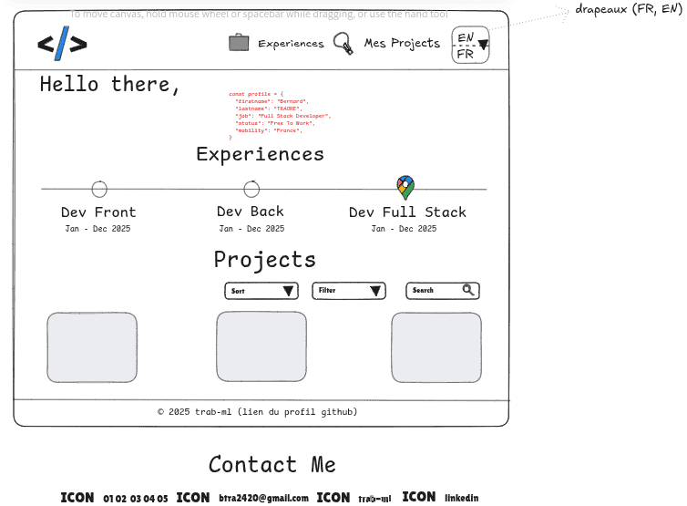
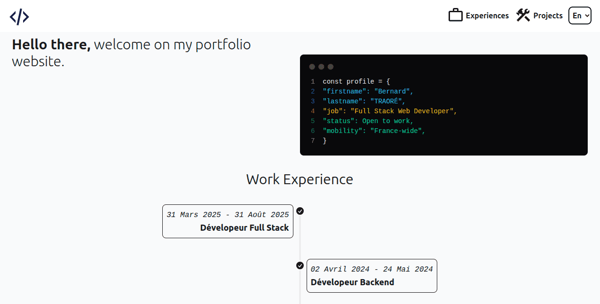
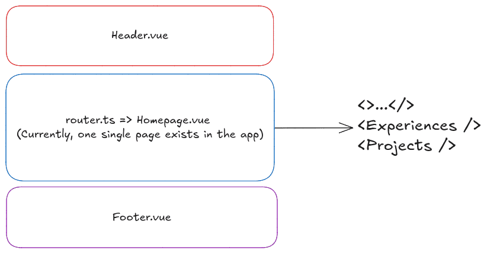

# Portfolio Website

Modern developer portfolio built with **Vue 3**, **TypeScript**, and **Vite**.

🔗 Live: <https://trab-ml.github.io/portfolio/>

---

## Features

- Responsive mobile-first design
- Component-based architecture (Atomic Design)
- Project & skills showcase
- Fast build with Vite
- GitHub Pages deployment

---

## Tech Stack

| Layer | Tech |
| ----- | ---- |
| Frontend | Vue 3 + TypeScript |
| UI | Vuetify |
| Build | Vite |
| Icons | Material Design Icons |
| Deploy | GitHub Pages |

---

## Setup

```bash
npm install
npm run dev
````

Mobile access:

```bash
npx vite --host
```

---

## Deploy

Build:

```bash
npm run build
```

Deploy (GitHub Pages):

```bash
git subtree add --prefix dist --squash
git subtree push --prefix dist origin gh-pages
```

Or use **GitHub Actions** (recommended).

---

## Preview

| Mock | Live | Components |
| ---- | ---- | ---------- |
|  |  |  |

---

## Project Structure

```text
src/
├── atoms/
├── composables/
├── data/
├── i18n/
├── molecules/
├── pages/
├── scripts/
├── style/
├── types/
├── utils/
└── molecules/
```

---

## Known Issues

| Issue                   | Fix                                       |
| ----------------------- | ----------------------------------------- |
| Vue icons typings       | Add `vue-shims.d.ts`                      |
| TS `erasableSyntaxOnly` | Avoid `enum`, use `as const`              |
| GitHub Pages 404        | Set `base: '/portfolio/'` + router config |

---

## Resources

- Atomic Design
- Vue Router
- Vite Docs
- Material Design Icons
- TypeScript 5.8 Notes
