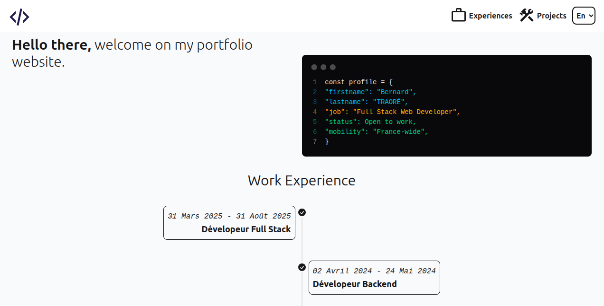

# Portfolio

[Get a look at my portfolio website.](https://trab-ml.github.io/portfolio/)

```bash
npm install # -D vite @vitejs/plugin-vue

npm run dev

# To access on mobile (if the computer and mobile are on the same network)
vite --host

# Two options to build and deploy on gh-pages
# Option 1: Using gh-pages subtree
git subtree add --prefix dist --squash
git subtree push --prefix dist origin gh-pages

# Option 2: Using GitHub Actions (need to setup the workflow file first)
```

## Mock


## Alive-Mock



## Components Overview


## Tricky issues

| Issue | Description | Solution |
| ----- | ----------- | -------- |
| Vue: Could not find a declaration file for module 'vue-material-design-icons/EyeOutline.vue'. '/home/trab/IdeaProjects/portfolio/node_modules/vue-material-design-icons/EyeOutline.vue' implicitly has an 'any' type.There are types at '/home/trab/IdeaProjects/portfolio/node_modules/vue-material-design-icons/EyeOutline.d.vue.ts', but this result could not be resolved when respecting package.json &quot;exports&quot;. The 'vue-material-design-icons' library may need to update its package.json or typings. | Occur for each icon of that lib and when lang is set to ts | A. Add a vue-shims.d.ts file <<<declare module "*.vue" { import Vue from "vue"; export default Vue;}>>> B. Add `// @ts-ignore` before each import of an icon |
| Vue: This syntax is not allowed when 'erasableSyntaxOnly' is enabled. | Occur when trying to export a TS enum in this way : export enum Category | set erasableSyntaxOnly to false in tsconfig files (not work for me); not use enum which is proper to ts and doesn't exist in js |
| Failed to load resource: the server responded with a status of 404 () | Occur when trying to access the website after deployment | More precised routing is required given that git can't natively support vue-router, so without exactly define that path of the deployed github page is supported in your app, the website wouldn't be accessible |

## Resources

- [Atomic design](https://bradfrost.com/blog/post/atomic-web-design/)
- [Aliasing in Vite](https://www.google.com/search?q=aliasing+in+vite&sca_esv=544fa928dd795f48&sxsrf=AE3TifMVX_MydbO4M44Ec_2vteQpk3GKTA%3A1758302499553&ei=I5HNaKHGIaemkdUP1LHDiAw&ved=0ahUKEwjh45Kfq-WPAxUnU6QEHdTYEMEQ4dUDCBA&uact=5&oq=aliasing+in+vite&gs_lp=Egxnd3Mtd2l6LXNlcnAiEGFsaWFzaW5nIGluIHZpdGUyCBAhGKABGMMESLUlUPwHWNIZcAJ4AZABAJgBVKABnASqAQE4uAEDyAEA-AEBmAIKoALyBMICChAAGLADGNYEGEfCAgYQABgHGB7CAggQABgHGAgYHsICBhAAGAgYHsICBRAAGO8FwgIKEAAYBxgIGAoYHsICCBAAGAUYBxgewgIIEAAYCBgKGB7CAggQABiABBjLAcICBBAAGB7CAgkQABiABBgTGA3CAggQABgTGA0YHsICChAAGBMYBRgNGB6YAwCIBgGQBgiSBwIxMKAHjDayBwE4uAfWBMIHBzAuMS43LjLIB0c&sclient=gws-wiz-serp)
- [Mobile first design](https://www.browserstack.com/guide/how-to-implement-mobile-first-design#:~:text=Mobile%2Dfirst%20design%20or%20Mobile,up%20to%20larger%20screen%20sizes.)
- [mdi](https://pictogrammers.com/library/mdi/)
- [vue router](https://router.vuejs.org/guide/)
- [erasable-syntax-only](https://www.totaltypescript.com/erasable-syntax-only)
- [TS release note about erasable-syntax-only](https://www.typescriptlang.org/docs/handbook/release-notes/typescript-5-8.html)
- [defence of ts enum](https://www.reddit.com/r/typescript/comments/1jobls9/defence_of_typescript_enums/)
- [Github Gist](https://gist.github.com/SKempin/b7857a6ff6bddb05717cc17a44091202)
- [static-deploy](https://vite.dev/guide/static-deploy)
- [icons8](https://icons8.com/icons)
